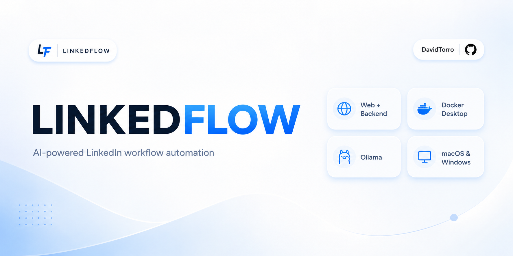
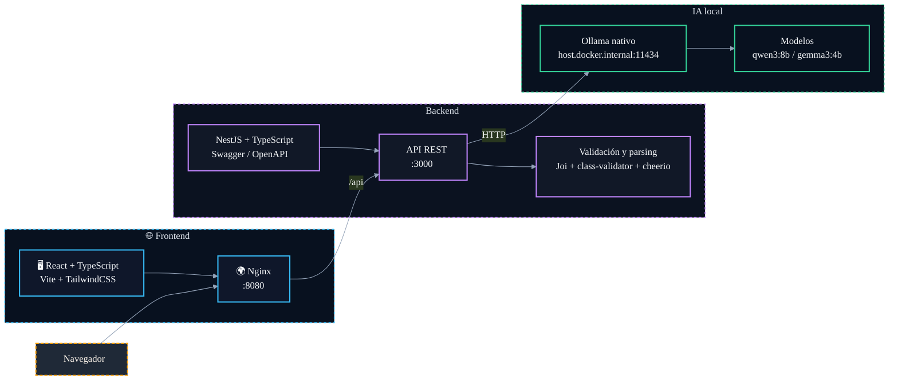

# 📝 LinkedFlow

         

LinkedFlow es una aplicación autoalojada para generar comentarios en LinkedIn con **IA local** 🤖. El backend está construido con **NestJS** y el frontend con **React + TypeScript**, de forma que puedes analizar publicaciones y crear comentarios sin enviar datos a servicios externos.

> 🔒 Toda la inferencia ocurre en local. Ollama se queda en tu ordenador y solo lo consume el backend; no es necesario exponerlo a internet.

---

## ⚙️ Stack técnico

- 🧩 **Backend**: NestJS, TypeScript, `@nestjs/config`, `@nestjs/swagger`, `@nestjs/platform-express`, Joi, class-validator, class-transformer, cheerio, RxJS y reflect-metadata.
- 🧪 **Testing backend**: Jest, Supertest, ts-jest y pruebas e2e para validar endpoints y flujos completos.
- 🎨 **Frontend**: React 19, React DOM, TypeScript, Vite, React Router y una arquitectura de páginas, layout y feature modules.
- 🪄 **UI del frontend**: TailwindCSS, PostCSS, Autoprefixer, lucide-react, class-variance-authority, clsx, tailwind-merge y componentes estilo shadcn/ui.
- 🧱 **Componentización**: `shared/ui`, `components/layout`, `features/comments`, utilidades de composición y componentes reutilizables.
- 🐳 **Infraestructura**: Docker, Docker Compose, Nginx como reverse proxy y despliegue por servicios separados.
- 🤖 **IA local**: Ollama con modelos para generación y visión, consumido desde el backend sin exponer el servicio.
- 🔧 **Tooling**: Nest CLI, ESLint, Prettier, TypeScript, Vite, PostCSS y Autoprefixer.

---

## ✨ Qué puedes hacer

- 🧠 Generar comentarios con IA a partir del contenido de un post.
- 👀 Analizar visualmente posts con un modelo de visión que interpreta el contenido extraído.
- 🔐 Mantener el flujo al 100 % local y privado, sin subir contenido a la nube.
- 🐳 Desplegar el frontend React y el backend NestJS con un único `docker compose`.
- 🛠️ Instalar automáticamente Docker, Ollama y los modelos en macOS y Windows.
- 🌍 Acceder desde la red local o mediante **Tailscale**.
- ⚡ Activar el autoarranque al iniciar sesión en el sistema.

---

## 🚀 Características

- **Generación de comentarios con IA** a partir del contenido de un post.
- **Análisis visual de posts** mediante un modelo de visión que interpreta el contenido extraído.
- **100 % local y privado**: la IA corre en Ollama nativo, sin enviar contenido a la nube.
- **Despliegue con Docker** para frontend y backend mediante un único `docker compose`.

## Arquitectura



| Componente | Tecnología                            | Detalle                                                                               |
| ---------- | ------------------------------------- | ------------------------------------------------------------------------------------- |
| `frontend` | React + TypeScript, servido por Nginx | Interfaz de usuario. Hace proxy de `/api` al backend. Expuesto en el puerto **8080**. |
| `backend`  | NestJS + TypeScript                   | API REST (Swagger opcional). Habla con Ollama. Escucha en el puerto **3000**.         |
| IA         | [Ollama](https://ollama.com) nativo   | Se ejecuta en el host, accesible desde Docker en `host.docker.internal:11434`.        |

### Modelos de IA

| Modelo      | Uso                                                   |
| ----------- | ----------------------------------------------------- |
| `qwen3:8b`  | Generación de comentarios.                            |
| `gemma3:4b` | Visión: análisis del contenido extraído de los posts. |

---

## Estructura del proyecto

```
LINKEDFLOW/
├── .dockerignore            # Ignora archivos al construir imágenes Docker
├── .env.example             # Variables de entorno de ejemplo
├── .gitignore               # Archivos y carpetas que Git no debe seguir
├── README.md                # Documentación principal del proyecto
├── README_CLIENTE.md        # Guía simplificada para cliente final
├── docker-compose.yml       # Orquestación de frontend, backend y servicios
│
├── docker/                  # Configuración Docker del frontend
│   ├── nginx.conf           # Configuración de Nginx
│   └── web.Dockerfile       # Imagen Docker del frontend
│
├── backend/                 # API NestJS y lógica de negocio
│   ├── .dockerignore        # Ignora archivos del backend al construir Docker
│   ├── .env.example         # Variables de entorno del backend
│   ├── Dockerfile           # Imagen Docker del backend
│   ├── eslint.config.mjs    # Configuración de ESLint
│   ├── nest-cli.json        # Configuración del CLI de Nest
│   ├── package-lock.json    # Bloqueo exacto de dependencias npm
│   ├── package.json         # Dependencias y scripts del backend
│   ├── tsconfig.build.json  # TypeScript para build de producción
│   ├── tsconfig.json        # TypeScript base del backend
│   │
│   ├── src/                 # Código fuente del backend
│   │   ├── app.module.ts    # Módulo raíz de NestJS
│   │   │
│   │   ├── config/
│   │   │   └── env.config.ts # Validación de variables de entorno
│   │   │
│   │   └── modules/
│   │       ├── comments/    # Funcionalidad de generación de comentarios
│   │       │   ├── application/   # Casos de uso de la app
│   │       │   │   ├── generate-comment.use-case.ts # Caso de uso principal
│   │       │   │   │
│   │       │   │   └── use-cases/
│   │       │   │       ├── check-ai-status.use-case.ts # Comprueba el estado de la IA
│   │       │   │       └── generate-comment-from-url.use-case.ts # Genera comentario desde URL
│   │       │   │
│   │       │   ├── domain/        # Entidades y reglas de negocio
│   │       │   │   ├── comment.ts # Entidad comentario
│   │       │   │   ├── comment-tone.ts # Tipos de tono
│   │       │   │   │
│   │       │   │   ├── errors/
│   │       │   │   │   └── comment-generation.error.ts # Error de generación
│   │       │   │   │
│   │       │   │   └── ports/      # Contratos para adaptadores externos
│   │       │   │       ├── ai-status.port.ts # Puerto de estado de IA
│   │       │   │       ├── comment-generator.port.ts # Puerto generador de comentarios
│   │       │   │       ├── post-scraper.port.ts # Puerto scraper de posts
│   │       │   │       └── vision-analyzer.port.ts # Puerto analizador visual
│   │       │   │
│   │       │   ├── infrastructure/ # Implementaciones externas
│   │       │   │   ├── ai/
│   │       │   │   │   ├── ollama.client.ts # Cliente HTTP para Ollama
│   │       │   │   │   ├── ollama-comment-generator.ts # Generador con Ollama
│   │       │   │   │   └── ollama-vision-analyzer.ts # Análisis visual con Ollama
│   │       │   │   │
│   │       │   │   └── scrapers/
│   │       │   │       └── linkedin-post-scraper.ts # Scraper de publicaciones de LinkedIn
│   │       │   │
│   │       │   └── presentation/
│   │       │       └── http/
│   │       │           ├── comments.controller.ts # Controlador HTTP de comentarios
│   │       │           └── dto/
│   │       │               ├── generate-comment.request.dto.ts # Entrada de la API
│   │       │               └── generate-comment.response.dto.ts # Salida de la API
│   │       │
│   │       └── health/     # Salud de la aplicación
│   │           ├── application/
│   │           │   └── check-health.use-case.ts # Caso de uso de health check
│   │           │
│   │           ├── health.module.ts # Módulo de salud
│   │           │
│   │           └── presentation/
│   │               └── health.controller.ts # Endpoint de salud
│   │
│   └── test/               # Pruebas e2e del backend
│       ├── comments.e2e-spec.ts # E2E de comentarios
│       ├── health.e2e-spec.ts    # E2E de health
│       └── jest-e2e.json         # Configuración de Jest e2e
│
├── frontend/                # Interfaz React + TypeScript
│   ├── .env.example         # Variables de entorno del frontend
│   ├── components.json      # Configuración de shadcn/ui
│   ├── index.html           # HTML raíz de Vite
│   ├── package-lock.json    # Bloqueo exacto de dependencias npm
│   ├── package.json         # Dependencias y scripts del frontend
│   ├── postcss.config.js    # Configuración de PostCSS
│   ├── tailwind.config.ts   # Configuración de TailwindCSS
│   ├── tsconfig.app.json    # TypeScript para la app
│   ├── tsconfig.json        # TypeScript base del frontend
│   ├── tsconfig.node.json   # TypeScript para tooling Node
│   ├── vite.config.ts       # Configuración de Vite
│   │
│   └── src/                 # Código fuente del frontend
│       ├── app/
│       │   ├── App.tsx      # App raíz del frontend
│       │   └── router.tsx   # Rutas de la aplicación
│       │
│       ├── components/
│       │   └── layout/
│       │       ├── AppLayout.tsx # Layout principal
│       │       ├── PageHead.tsx  # Título y metadatos de página
│       │       ├── Sidebar.tsx   # Barra lateral
│       │       └── Topbar.tsx    # Barra superior
│       │
│       ├── features/
│       │   └── comments/    # Feature de comentarios
│       │       ├── application/
│       │       │   ├── generateComment.ts # Lógica de generación
│       │       │   │
│       │       │   ├── hooks/
│       │       │   │   ├── useAiHealth.ts # Estado de la IA
│       │       │   │   └── useCommentStreaming.ts # Streaming de respuestas
│       │       │   │
│       │       │   └── use-cases/
│       │       │       └── generateCommentFromUrl.ts # Caso de uso UI
│       │       │
│       │       ├── domain/
│       │       │   └── types.ts # Tipos del dominio
│       │       │
│       │       ├── infrastructure/
│       │       │   └── api/
│       │       │       └── commentsApi.ts # Cliente API de comentarios
│       │       │
│       │       └── presentation/
│       │           ├── CommentsPage.tsx   # Página de comentarios
│       │           │
│       │           ├── components/
│       │           │   ├── AiStatusBadge.tsx  # Badge de estado IA
│       │           │   └── CommentsFromUrl.tsx # Formulario desde URL
│       │           │
│       │           └── hooks/
│       │               └── useGenerateComment.ts # Hook de generación
│       │
│       ├── pages/
│       │   └── NotFoundPage.tsx # Página 404
│       │
│       └── shared/            # Recursos compartidos
│           ├── api/
│           │   └── http/
│           │       ├── httpClient.ts # Cliente HTTP base
│           │       ├── httpClient.types.ts # Tipos del cliente HTTP
│           │       ├── httpClient.utils.ts # Utilidades del cliente HTTP
│           │       ├── httpError.ts # Error HTTP común
│           │       └── httpRequest.ts # Wrapper de request
│           │
│           ├── config/
│           │   └── env.ts   # Lectura de variables de entorno
│           │
│           ├── hooks/
│           │   └── useTheme.ts # Hook de tema
│           │
│           ├── styles/
│           │   └── globals.css # Estilos globales
│           │
│           ├── ui/
│           │   ├── Badge.tsx  # Componente badge
│           │   ├── Button.tsx # Componente botón
│           │   ├── Card.tsx   # Componente tarjeta
│           │   ├── Input.tsx  # Componente input
│           │   └── index.ts   # Exportaciones de UI
│           │
│           └── utils/
│               └── cn.ts    # Helper para clases CSS
│
└── scripts/                 # Scripts de instalación y arranque
    ├── mac/
    │
    └── windows/

```

---

## Licencia

Este proyecto es software propietario. Todos los derechos reservados.

Copyright (c) 2026 David Torro. Ver el archivo [LICENSE](LICENSE) para más detalles.
